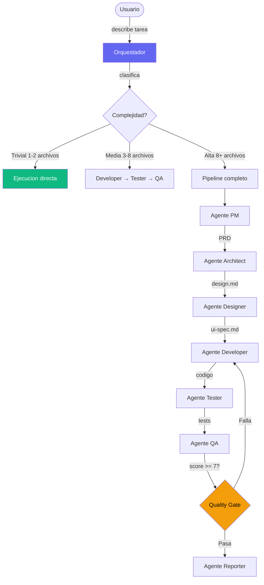

[Read in English](README.md)

# Forge

Sistema de orquestacion de agentes IA. Define agentes, skills y convenciones una sola vez — despliega a Claude Code, OpenCode, Gemini CLI, Codex y Cursor. Compatible con el estandar abierto [AGENTS.md](https://agents.md/).

## Que es Forge?

Forge es una coleccion de **agentes** (roles especializados de IA), **skills** (conocimiento de dominio y convenciones) y un **CLI** que los despliega a tus herramientas de desarrollo con IA. Escribes tus agentes y skills en markdown, ejecutas `forge deploy`, y cada herramienta recibe el mismo conocimiento.

Forge genera automaticamente un archivo `AGENTS.md` en la raiz del proyecto — el [estandar abierto](https://agents.md/) mantenido por la Linux Foundation y adoptado por Codex, Cursor, Copilot y otros.

## Manual de Uso

Para una guia completa de como usar Forge en el dia a dia — invocar skills, usar agentes, flujos de trabajo tipicos, convenciones por stack y tips — lee el **[Manual de Uso](docs/manual.es.md)**.

## Inicio Rapido

```bash
# 1. Clonar
git clone https://github.com/ernesto2108/forge.git ~/projects/forge
cd ~/projects/forge

# 2. Compilar el CLI (requiere Go 1.25+)
make build

# 3. Hacerlo disponible globalmente (opcional)
ln -sf ~/projects/forge/forge /usr/local/bin/forge

# 4. Elegir targets (a que herramientas desplegar)
forge targets claude opencode    # o: all

# 5. Elegir provider (mapeo de modelos)
forge provider claude            # o: gemini, local

# 6. Desplegar
forge deploy

# 7. Verificar
forge status
```

> Despues del paso 3, puedes ejecutar `forge` desde cualquier lugar. Si lo omites, usa `./forge` desde el directorio de forge.

## Como Funciona



Cada agente tiene limites estrictos:
- **developer** solo escribe codigo de produccion
- **tester** solo escribe archivos de test
- **dba** solo gestiona migraciones
- **devops** solo gestiona infra/CI
- Los agentes nunca cruzan limites

## Estructura del Proyecto

```
forge/
├── cmd/forge/             # CLI de despliegue (Go)
├── internal/              # Paquetes core (config, deploy, state, etc.)
├── forge.yaml             # Manifiesto de despliegue (targets, componentes)
├── forge.config.yaml      # Mapeo de proveedores y modelos
├── AGENTS.md              # Auto-generado — estandar abierto para herramientas IA
├── agents/                # 12 agentes especializados
├── skills/                # 38 skills de dominio y convenciones
├── commands/              # Comandos invocables por el usuario
├── docs/                  # Documentacion interna
├── examples/              # Template de CLAUDE.md para proyectos
└── vault-template/        # Template de vault Obsidian para documentacion
```

## Agentes

Cada agente es un archivo markdown con frontmatter YAML que define su rol, permisos y nivel de modelo.

| Agente | Rol | Permiso | Nivel |
|--------|-----|---------|-------|
| **pm** | Requisitos, PRDs, backlog, planificacion de sprints | write | high |
| **architect** | Diseno de sistema, contratos API, ADRs | write | high |
| **designer** | Diseno UX/UI, design system, flujos de usuario | write | high |
| **developer** | Codigo de produccion (Go, React, Flutter, Astro) | execute | medium |
| **tester** | Archivos de test en todos los stacks | execute | medium |
| **dba** | Migraciones, diseno de schema, optimizacion de queries | execute | medium |
| **devops** | CI/CD, Docker, Terraform, K8s, infra cloud | execute | medium |
| **qa** | Code review, quality gate (bloquea si score < 7) | execute | medium |
| **security** | SAST, SCA, auditoria de secretos, revision de auth | execute | medium |
| **scanner** | Escaneo de repositorio, generacion de contexto | execute | medium |
| **tech-writer** | Documentacion, README, API docs, changelogs | write | medium |
| **reporter** | Reportes de ejecucion de sesion | execute | low |

### Como funcionan los agentes

- El orquestador (tu o `/orchestrate`) clasifica la complejidad de la tarea
- **Trivial**: se ejecuta directo, sin agentes
- **Medium+**: los agentes corren en secuencia con gates entre fases
- Cada agente tiene limites estrictos — developer no toca tests, tester no toca codigo de produccion

### Permisos

| Nivel | Herramientas disponibles |
|-------|-------------------------|
| **read** | Glob, Grep, LS, Read |
| **write** | + Write, Edit |
| **execute** | + Bash |

### Niveles de modelo

| Nivel | Uso | Ejemplo Claude | Ejemplo Gemini |
|-------|-----|----------------|----------------|
| **high** | Decisiones complejas (PM, Architect) | Opus | gemini-2.5-pro |
| **medium** | Implementacion (Developer, Tester) | Sonnet | gemini-2.5-flash |
| **low** | Tareas simples (Reporter) | Haiku | gemini-2.5-flash-lite |

## Skills

Las skills son modulos de conocimiento que se cargan bajo demanda segun la tarea.

### Convenciones por Stack

| Skill | Cubre |
|-------|-------|
| `/go-conventions` | Manejo de errores, validacion, SQL, concurrencia, testing, Kafka, RabbitMQ |
| `/react-conventions` | Hooks, estado, Tailwind v4, accesibilidad, testing, anti-patrones |
| `/flutter-conventions` | BLoC/Riverpod, composicion de widgets, theming, testing |
| `/astro-conventions` | Islands, content collections, componentes, estilos |
| `/devops-conventions` | Docker, GitHub Actions, Terraform, K8s, AWS, GCP, Argo CD/Workflows/Rollouts |

### Skills de Workflow

| Skill | Proposito |
|-------|-----------|
| `/orchestrate` | Clasificar complejidad, seleccionar agentes, gestionar gates |
| `/lint` | Auto-detecta stack, corre linters y formatters |
| `/run-tests` | Auto-detecta stack, corre tests con cobertura |
| `/design-system` | Crear tokens, variables, componentes (Pencil/Figma) |
| `/design-review` | Auditoria de calidad de disenos con puntaje |
| `/design-to-code` | Traducir disenos a codigo de produccion |
| `/prd-template` | Escritura de PRD con cuestionario de descubrimiento |
| `/backlog-management` | Dividir PRDs en tickets, gestionar sprints |

### Skills de Guardia

| Skill | Proposito |
|-------|-----------|
| `/architecture-boundary-guardrails` | Enforzar bounded contexts, prevenir leaks entre dominios |
| `/domain-entity-guardrails` | Tipado estricto, sin punteros para campos opcionales |
| `/code-review-rubric` | Criterios de puntuacion para reviews de QA |

### Skills de Utilidad

| Skill | Proposito |
|-------|-----------|
| `/dependency-check` | Auditar paquetes por vulnerabilidades y licencias |
| `/bundle-analyzer` | Analisis de impacto en tamano de bundle frontend |
| `/db-schema-scan` | Inspeccion read-only de schema via migraciones |
| `/db-optimize` | Identificar queries lentos, sugerir indices |
| `/generate-diagram` | Diagramas Mermaid.js (C4, ERD, secuencia, flujo) |
| `/git-diff` | Resumir cambios del repositorio |
| `/service-map` | Dependencias entre microservicios |
| `/a11y-check` | Auditoria de accesibilidad WCAG 2.1 |
| `/test-api` | Validacion de contratos de API endpoints |
| `/ui-component-scan` | Escanear libreria de componentes para reusar |

## Referencia del CLI

```bash
# Despliegue
forgedeploy                     # Desplegar todos los componentes a targets activos
forgestatus                     # Mostrar que esta desplegado donde

# Targets (a que herramientas desplegar)
forgetargets                    # Mostrar targets activos
forgetargets claude opencode    # Definir targets exactos
forgetargets --add gemini       # Habilitar un target
forgetargets --rm cursor        # Deshabilitar un target
forgetargets all                # Habilitar todos

# Provider (mapeo de modelos)
forgeprovider                   # Mostrar provider actual
forgeprovider gemini            # Cambiar a modelos Gemini
forgeprovider local             # Cambiar a modelos locales/Ollama

# Versionado
forgepin skills/go-conventions v1.2.0    # Fijar a un git tag
forgeunpin skills/go-conventions         # Volver a seguir HEAD

# Mantenimiento
forgediff                       # Mostrar cambios desde ultimo deploy
forgeuninstall                  # Remover de todos los targets
```

## Configuracion

### `forge.yaml` — Manifiesto de despliegue

Define que targets estan habilitados y que componentes desplegar:

```yaml
targets:
  claude:
    enabled: true
    path: ~/.claude
  opencode:
    enabled: true
    path: ~/.config/opencode
  gemini:
    enabled: true
    path: ~/.gemini
  codex:
    enabled: true
    path: ~/.codex
  cursor:
    enabled: false

components:
  agents:
    tag: "HEAD"      # Sigue la rama actual
  skills:
    tag: "HEAD"
  commands:
    tag: "HEAD"
```

### `forge.config.yaml` — Mapeo de proveedores y modelos

Mapea los niveles de agentes (high/medium/low) a nombres de modelos reales por proveedor:

```yaml
provider: claude

providers:
  claude:
    high: opus
    medium: sonnet
    low: haiku
  gemini:
    high: gemini-2.5-pro
    medium: gemini-2.5-flash
    low: gemini-2.5-flash-lite
  local:
    high: qwen3:32b
    medium: qwen3:14b
    low: qwen3:8b
```

## Crear Nuevos Agentes

Crear `agents/{nombre}.md`:

```markdown
---
name: mi-agente
description: Descripcion en una linea que el sistema usa para decidir cuando invocar este agente
permission: execute    # read | write | execute
model: medium          # high | medium | low
---

# Agent Spec — Titulo del Rol

## Role
Que hace este agente y que NO hace.

## Input
Que le proporciona el orquestador.

## Rules
Restricciones y permisos especificos.

## Output
Que produce y donde lo escribe.
```

## Crear Nuevas Skills

Crear `skills/{nombre}/SKILL.md`:

```markdown
---
name: mi-skill
description: Descripcion en una linea de lo que enseña esta skill
---

# Nombre de la Skill

## When to Load
Condiciones que disparan la carga de esta skill.

## Contenido
El conocimiento, convenciones y patrones.
```

Para skills complejas, usar subdirectorios con tabla de ruteo:

```
skills/mi-skill/
├── SKILL.md           # Dispatcher con tabla de ruteo
├── rules/             # Archivos de referencia rapida
├── guides/            # Patrones detallados
└── examples/          # Patrones buenos y malos
```

## Vault de Documentacion

Usar `vault-template/` para inicializar un vault Obsidian en cualquier proyecto:

```bash
cp -r vault-template/ ~/projects/mi-proyecto-knowledge-base/
```

Estructura:
```
01-project/context.md         # Output del scanner
02-backlog/sprint-current.md  # Board del sprint
03-tasks/<ID>/                # PRD, design, QA por tarea
04-architecture/              # ADRs, bounded contexts
05-bugs/                      # Postmortems
06-reports/last-run.md        # Reportes de sesion
07-references/                # Templates, links externos
08-design/                    # Archivos de diseno (.pen, .fig)
```

## Backup y Restauracion

Forge protege tus archivos existentes automaticamente:

- **Primer deploy**: guarda snapshot de todo lo que encuentra en `~/.claude/`, `~/.codex/`, etc.
- **Cada deploy**: hace backup con timestamp si detecta cambios manuales
- **Uninstall**: restaura los archivos originales desde el snapshot

Ver [seccion completa en el manual](docs/manual.es.md#8-backup-y-restauracion).

## Compatibilidad con AGENTS.md

[AGENTS.md](https://agents.md/) es un estandar abierto mantenido por la Linux Foundation para configurar agentes de IA en proyectos de software. Forge genera automaticamente este archivo cada vez que ejecutas `forge deploy`.

### Que herramientas lo leen?

| Herramienta | Lee AGENTS.md | Archivo nativo |
|---|---|---|
| **OpenAI Codex** | Si (primario) | `~/.codex/AGENTS.md` |
| **Cursor** | Si (en raiz del repo) | `.cursor/rules/*.mdc` |
| **GitHub Copilot** | Via `.github/copilot-instructions.md` | `.github/agents/*.agent.md` |
| **OpenCode** | Si (primario) | — |
| **Claude Code** | No (usa `CLAUDE.md`) | `~/.claude/agents/*.md` |
| **Gemini CLI** | Discusion activa | `GEMINI.md` |

### Como funciona en Forge

1. Defines agentes en `agents/*.md` con frontmatter (rol, permisos, nivel)
2. Al hacer `forge deploy`, Forge:
   - Despliega agentes nativos a cada target (Claude, OpenCode, Gemini, etc.)
   - Genera `AGENTS.md` en la raiz del repo compilando todos los agentes
   - Copia `AGENTS.md` a `~/.codex/` para Codex
3. Cualquier herramienta compatible con AGENTS.md puede leer el archivo generado

### Generar manualmente

```bash
# El deploy lo genera automaticamente, pero tambien puedes:
./forgedeploy    # Genera AGENTS.md + despliega todo
```

## Licencia

MIT
