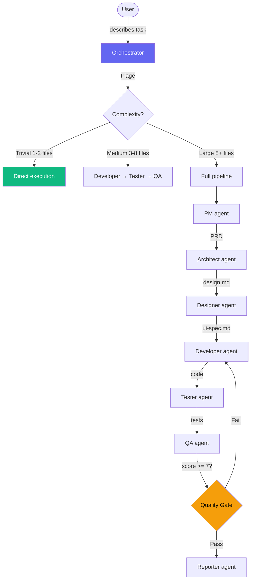

[Leer en espanol](README.es.md)

# Forge

AI agent orchestration system. Define agents, skills, and conventions once — deploy to Claude Code, OpenCode, Gemini CLI, Codex, and Cursor. Compatible with the [AGENTS.md](https://agents.md/) open standard.

## What is Forge?

Forge is a collection of **agents** (specialized AI roles), **skills** (domain knowledge and conventions), and a **CLI** that deploys them to your AI coding tools. Write your agents and skills in markdown, run `forge deploy`, and every tool gets the same knowledge.

Forge automatically generates an `AGENTS.md` file — the [open standard](https://agents.md/) maintained by the Linux Foundation and adopted by Codex, Cursor, Copilot, and others.

## User Manual

For a complete guide on daily usage — invoking skills, using agents, typical workflows, per-stack conventions, and tips — read the **[User Manual](docs/manual.md)**.

## Quick Start

```bash
# 1. Clone
git clone https://github.com/ernesto2108/forge.git ~/projects/forge
cd ~/projects/forge

# 2. Make the CLI available globally (pick one)
# Option A: symlink (recommended)
ln -sf ~/projects/forge/forge-cli /usr/local/bin/forge

# Option B: alias in your shell profile (~/.zshrc or ~/.bashrc)
echo 'alias forge="~/projects/forge/forge-cli"' >> ~/.zshrc
source ~/.zshrc

# 3. Choose your targets (which tools to deploy to)
forge targets claude opencode    # or: all

# 4. Choose your provider (model tier mapping)
forge provider claude            # or: gemini, local

# 5. Deploy
forge deploy

# 6. Verify
forge status
```

> After step 2, you can run `forge` from anywhere. If you skip it, use `./forge-cli` from the forge directory.

## How It Works



Each agent has strict boundaries:
- **developer** writes production code only
- **tester** writes test files only
- **dba** manages migrations only
- **devops** manages infra/CI only
- Agents never cross boundaries

## Project Structure

```
forge/
├── forge-cli              # Deployment CLI (bash)
├── forge.yaml             # Deployment manifest (targets, components)
├── forge.config.yaml      # Provider & model mapping
├── agents/                # 12 specialized agent definitions
├── skills/                # 38 domain skills and conventions
├── commands/              # User-invocable slash commands
├── docs/                  # Documentation (en + es)
├── examples/              # CLAUDE.md template for projects
└── vault-template/        # Obsidian vault template for documentation
```

## Agents

Each agent is a markdown file with YAML frontmatter defining its role, permissions, and model tier.

| Agent | Role | Permission | Tier |
|-------|------|------------|------|
| **pm** | Requirements, PRDs, backlog, sprint planning | write | high |
| **architect** | System design, API contracts, ADRs | write | high |
| **designer** | UX/UI design, design system, user flows | write | high |
| **developer** | Production code (Go, React, Flutter, Astro) | execute | medium |
| **tester** | Test files across all stacks | execute | medium |
| **dba** | Migrations, schema design, query optimization | execute | medium |
| **devops** | CI/CD, Docker, Terraform, K8s, cloud infra | execute | medium |
| **qa** | Code review, quality gate (blocks if score < 7) | execute | medium |
| **security** | SAST, SCA, secrets audit, auth review | execute | medium |
| **scanner** | Repository scanning, project context generation | execute | medium |
| **tech-writer** | Documentation, README, API docs, changelogs | write | medium |
| **reporter** | Session execution reports | execute | low |

### How agents work

- The orchestrator (you or `/orchestrate`) triages task complexity
- **Trivial** tasks: execute directly, no agents
- **Medium+**: agents run in sequence with gates between phases
- Each agent has strict boundaries — developer can't touch tests, tester can't touch production code

### Permissions

| Level | Available tools |
|-------|----------------|
| **read** | Glob, Grep, LS, Read |
| **write** | + Write, Edit |
| **execute** | + Bash |

### Model tiers

| Tier | Use case | Claude example | Gemini example |
|------|----------|----------------|----------------|
| **high** | Complex decisions (PM, Architect) | Opus | gemini-2.5-pro |
| **medium** | Implementation (Developer, Tester) | Sonnet | gemini-2.5-flash |
| **low** | Simple tasks (Reporter) | Haiku | gemini-2.5-flash-lite |

## Skills

Skills are loadable knowledge modules. Agents load them on-demand based on the task.

### Per-Stack Conventions

| Skill | Covers |
|-------|--------|
| `/go-conventions` | Error handling, validation, SQL, concurrency, testing, Kafka, RabbitMQ |
| `/react-conventions` | Hooks, state management, Tailwind v4, accessibility, testing, anti-patterns |
| `/flutter-conventions` | BLoC/Riverpod, widget composition, theming, testing |
| `/astro-conventions` | Islands, content collections, components, styling |
| `/devops-conventions` | Docker, GitHub Actions, Terraform, K8s, AWS, GCP, Argo CD/Workflows/Rollouts |

### Workflow Skills

| Skill | Purpose |
|-------|---------|
| `/orchestrate` | Triage complexity, select agents, manage gates |
| `/lint` | Auto-detect stack, run linters and formatters |
| `/run-tests` | Auto-detect stack, run tests with coverage |
| `/design-system` | Create design tokens, variables, components (Pencil/Figma) |
| `/design-review` | Quality audit of designs with scoring |
| `/design-to-code` | Translate designs to production code |
| `/prd-template` | PRD writing with discovery questionnaire |
| `/backlog-management` | Break PRDs into tickets, manage sprints |

### Guard Skills

| Skill | Purpose |
|-------|---------|
| `/architecture-boundary-guardrails` | Enforce bounded contexts, prevent cross-domain leaks |
| `/domain-entity-guardrails` | Strict typing, no pointers for optional fields |
| `/code-review-rubric` | Scoring criteria for QA reviews |

### Utility Skills

| Skill | Purpose |
|-------|---------|
| `/dependency-check` | Audit packages for vulnerabilities and licenses |
| `/bundle-analyzer` | Frontend bundle size impact analysis |
| `/db-schema-scan` | Read-only schema inspection via migrations |
| `/db-optimize` | Slow query identification, index suggestions |
| `/generate-diagram` | Mermaid.js diagrams (C4, ERD, sequence, flow) |
| `/git-diff` | Summarize repository changes |
| `/service-map` | Cross-service dependency awareness |
| `/a11y-check` | WCAG 2.1 accessibility audit |
| `/test-api` | API endpoint contract validation |
| `/ui-component-scan` | Scan component library for reuse |

## CLI Reference

```bash
# Deployment
forge-cli deploy                     # Deploy all components to active targets
forge-cli status                     # Show what's deployed where

# Targets (which AI tools to deploy to)
forge-cli targets                    # Show active targets
forge-cli targets claude opencode    # Set exact targets
forge-cli targets --add gemini       # Enable one target
forge-cli targets --rm cursor        # Disable one target
forge-cli targets all                # Enable all

# Provider (model mapping)
forge-cli provider                   # Show current provider
forge-cli provider gemini            # Switch to Gemini models
forge-cli provider local             # Switch to local/Ollama models

# Version pinning
forge-cli pin skills/go-conventions v1.2.0    # Pin to git tag
forge-cli unpin skills/go-conventions         # Follow HEAD again

# Maintenance
forge-cli diff                       # Show changes since last deploy
forge-cli uninstall                  # Remove from all targets
```

## Configuration

### `forge.yaml` — Deployment manifest

```yaml
targets:
  claude:
    enabled: true
    path: ~/.claude
  opencode:
    enabled: true
    path: ~/.config/opencode
  gemini:
    enabled: true
    path: ~/.gemini
  codex:
    enabled: true
    path: ~/.codex
  cursor:
    enabled: false

components:
  agents:
    tag: "HEAD"
  skills:
    tag: "HEAD"
  commands:
    tag: "HEAD"
```

### `forge.config.yaml` — Provider & model mapping

```yaml
provider: claude

providers:
  claude:
    high: opus
    medium: sonnet
    low: haiku
  gemini:
    high: gemini-2.5-pro
    medium: gemini-2.5-flash
    low: gemini-2.5-flash-lite
  local:
    high: qwen3:32b
    medium: qwen3:14b
    low: qwen3:8b
```

## Backup & Restore

Forge automatically protects your existing files:

- **First deploy**: snapshots everything found in `~/.claude/`, `~/.codex/`, etc.
- **Each deploy**: timestamps backup if it detects manual changes
- **Uninstall**: restores original files from the snapshot

See [full section in the manual](docs/manual.md#8-backup--restore).

## AGENTS.md Compatibility

[AGENTS.md](https://agents.md/) is an open standard maintained by the Linux Foundation for configuring AI agents in software projects. Forge generates this file automatically on every `forge deploy`.

### Which tools read it?

| Tool | Reads AGENTS.md | Native file |
|---|---|---|
| **OpenAI Codex** | Yes (primary) | `~/.codex/AGENTS.md` |
| **Cursor** | Yes (repo root) | `.cursor/rules/*.mdc` |
| **GitHub Copilot** | Via `.github/copilot-instructions.md` | `.github/agents/*.agent.md` |
| **OpenCode** | Yes (primary) | — |
| **Claude Code** | No (uses `CLAUDE.md`) | `~/.claude/agents/*.md` |
| **Gemini CLI** | Discussion active | `GEMINI.md` |

### How it works in Forge

1. Define agents in `agents/*.md` with frontmatter (role, permissions, tier)
2. On `forge deploy`, Forge:
   - Deploys native agents to each target (Claude, OpenCode, Gemini, etc.)
   - Generates compact `AGENTS.md` to `~/.codex/` for Codex
3. Any AGENTS.md-compatible tool can read the generated file

## Creating New Agents

Create `agents/{name}.md`:

```markdown
---
name: my-agent
description: One-line description the system uses to decide when to invoke this agent
permission: execute    # read | write | execute
model: medium          # high | medium | low
---

# Agent Spec — Role Title

## Role
What this agent does and what it does NOT do.

## Input
What the orchestrator provides.

## Rules
Specific constraints and permissions.

## Output
What it produces and where.
```

## Creating New Skills

Create `skills/{name}/SKILL.md`:

```markdown
---
name: my-skill
description: One-line description of what this skill teaches
---

# Skill Name

## When to Load
Conditions that trigger loading this skill.

## Content
The actual knowledge, conventions, and patterns.
```

For complex skills, use subdirectories with a routing table:

```
skills/my-conventions/
├── SKILL.md           # Dispatcher with routing table
├── rules/             # Quick reference files
├── guides/            # Detailed patterns
└── examples/          # Good + bad patterns
```

## Documentation Vault

Use `vault-template/` to bootstrap an Obsidian vault for any project:

```bash
cp -r vault-template/ ~/projects/my-project-knowledge-base/
```

Structure:
```
01-project/context.md         # Scanner output
02-backlog/sprint-current.md  # Sprint board
03-tasks/<ID>/                # PRD, design, QA per task
04-architecture/              # ADRs, bounded contexts
05-bugs/                      # Postmortems
06-reports/last-run.md        # Session reports
07-references/                # Templates, external links
08-design/                    # Design files (.pen, .fig)
```

## License

MIT
