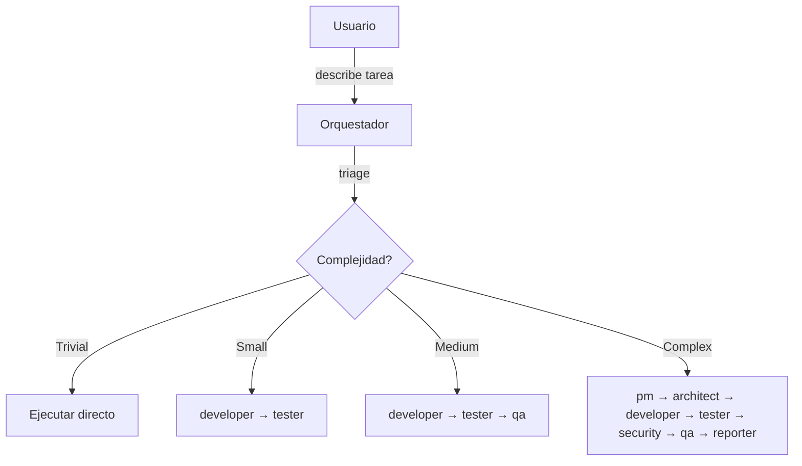
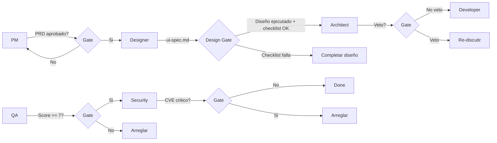

# Orquestacion de Agentes

## Como funciona

El sistema actua como orquestador. Cuando recibe una tarea:

1. **Triagea** la complejidad (Trivial/Small/Medium/Complex)
2. **Propone** que agentes correr
3. **Confirma** con el usuario (si es Complex+)
4. **Ejecuta** el pipeline en orden
5. **Respeta gates** — si uno falla, para

## Step 0 — Triage (SIEMPRE PRIMERO)

| Signal | Level | Pipeline | Docs | Context |
|--------|-------|----------|------|---------|
| Typo, config, 1-2 files, clear fix | **Trivial** | Directo — sin agentes | Ninguno | En conversacion |
| Bug fix, refactor, 2-5 files, patron conocido | **Small** | developer → tester | Sin PRD/design | Inline en prompt del agente |
| Feature nueva, endpoint nuevo, decisiones de diseno | **Medium** | developer → tester → qa | PRD minimo | PRD + archivos clave |
| Cross-cutting, nuevo contexto, UI+backend, multi-servicio | **Complex** | pm → architect → developer → tester → security → qa → reporter | PRD + Design completos | Docs completos |

## Reglas de token efficiency

### Context injection (Small/Medium)
En vez de que cada agente lea archivos por su cuenta, el orquestador:
1. Lee los archivos relevantes UNA vez
2. Inyecta el contenido directamente en el prompt del agente
3. Esto evita que 3 agentes lean los mismos 5 archivos (ahorro ~30-50%)

### Cuando crear PRD/design
| Pts | PRD | Design |
|-----|-----|--------|
| 1-3 | No | No |
| 3-5 | No | No |
| 5-8 | Si (minimo) | Opcional |
| 8+ | Si (completo) | Si |

### Cuando invocar convention skills
| Nivel | Convention Skill |
|-------|-----------------|
| Trivial | No |
| Small | No — inyectar reglas clave si es necesario |
| Medium | Si, en developer y tester |
| Complex | Si, en todos los que aplique |

## Flujo del pipeline



## Triage automatico

El orquestador se hace estas preguntas internamente (no al usuario):

| Pregunta | Si la respuesta es si |
|----------|----------------------|
| Necesito tomar decisiones de diseno? | Medium+ |
| Toca UI? | Agregar designer |
| Toca schema de DB? | Agregar dba |
| Toca infra/CI? | Agregar devops |
| Toca auth o datos sensibles? | Agregar security |
| Falta context.md o esta viejo? | Agregar scanner |
| El alcance no esta claro? | Empezar con pm |

## Reglas de skip

No todos los agentes corren siempre:

| Agente | Saltar cuando |
|--------|--------------|
| scanner | context.md existe y se actualizo en esta sesion |
| pm | requirements ya son claros y especificos |
| designer | no hay cambios de UI |
| architect | no hay decisiones de diseno (patron ya existe) |
| dba | no hay cambios de DB |
| devops | no hay cambios de infra |
| security | no toca auth, datos sensibles, ni APIs externas |
| qa | tarea < 5 pts sin riesgo (security/concurrency/cross-context) |
| reporter | tareas Trivial o Small |
| tester | no hay codigo testeable (docs, config) |

## Lo que NUNCA se salta

- **developer** — si hay codigo que escribir
- **lint + run-tests** — antes de dar por terminado

## Gates



### Design Execution Gate (detalle)

Despues de ejecutar el diseño visual (en Pencil/Figma), verificar ANTES de continuar:

1. Todas las pantallas del Screen Inventory de ui-spec.md existen en el archivo de diseño
2. Versiones mobile existen para cada pantalla (si responsive/both)
3. Versiones dark mode existen para pantallas clave (si modos requeridos)
4. Frame de Design System tiene: paleta de colores, tipografia, iconos, espaciado, radius
5. Estados interactivos diseñados: dropdowns abiertos, modales, menus expandidos
6. Toggle de tema diseñado y ubicado (desktop + mobile)
7. Menu de usuario/perfil diseñado (desktop dropdown + mobile hamburger)
8. Cada CTA/boton tiene su pantalla destino diseñada

**Tip:** Cargar `/design-recipes` durante la ejecucion del diseño para reducir operaciones por pantalla.

## Paso de contexto

### Small tasks — inline context
El orquestador inyecta TODO en el prompt del agente:
- Contenido de archivos relevantes (ya leidos)
- Que cambiar, patron a seguir
- Reglas de convencion clave (sin cargar skill completo)

### Medium/Complex tasks — doc references
Cada agente recibe SOLO lo que necesita:

| Agente | Recibe | NO recibe |
|--------|--------|-----------|
| pm | vault path, request del usuario | codigo, diffs |
| scanner | root del proyecto | tareas |
| designer | prd.md, context.md | codigo, reportes |
| architect | prd.md, ui-spec.md, context.md | codigo, reportes |
| developer | prd.md, design.md, ui-spec.md, skill | reportes QA/security |
| tester | prd.md, design.md, archivos cambiados | diffs completos |
| qa | prd.md, design.md, git diff | historial de conversacion |
| security | git diff, paths de dependencias | requirements, diseno |
| reporter | TASK-ID, resumen de git diff | contexto minimo |

## Invocacion

Escribir `/orchestrate` seguido de la tarea:

```
> /orchestrate necesito un endpoint de registro con validacion de email
```

El orquestador responde con el triage y espera confirmacion antes de arrancar.
